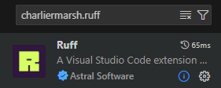

# Ruff

## Instruções de instalação
Antes de instalar o Ruff, certifique-se de que você possui o Python instalado em sua máquina. O Ruff suporta versões do Python a partir da 3.7


```bash
# pip
pip install ruff

# pipx (recomendado por questões de isolamento)
pipx install ruff && pipx ensurepath

# Após reiniciar o terminal o ruff deve estar disponível
ruff --version
```

## Como a ferramenta se integra ao ambiente de desenvolvimento <br/>& estilização de maneira automática

O Ruff pode ser integrado a diversos editores e ambientes de desenvolvimento para facilitar a análise e formatação de código automaticamente

### Integração com VSCode

* Instalar a extensão `charliermarsh.ruff`

<div align="center">
    
</div>

* Alterar as preferências de usuário: `ctrl+shif+p` pesquisar por `Open User Settings` e adicionar as configurações de formatador e para formatar ao salvar

```json
{
    "editor.defaultFormatter": "charliermarsh.ruff",
    "editor.formatOnSave": true, 
}
```

## Quais são os o guias de estilo utilizados pelo linter
O Ruff suporta e implementa diversas regras baseadas nos guias de estilo mais populares da comunidade Python. Entre eles, destacam-se:

- PEP 8 – Guia oficial de estilo para código Python.
- PEP 257 – Guia de estilo para docstrings em Python.
- Flake8 – Conjunto de regras amplamente adotado para análise de código.
- PyLint – Conjunto de verificações de qualidade de código para Python.
- isort – Organização automática de imports.
- Black – Estilização automática de código.


## Pelo menos três regras de estilo que podem ser configuradas pelo linter

Algumas das principais regras que podem ser ajustadas incluem:

- Indentação e espaços em branco (E101, E111):

    Garante que a indentação seja consistente e utiliza espaços corretamente.

- Comprimento máximo de linha (E501):

    Define um limite para o comprimento das linhas de código, seguindo a recomendação da PEP 8.

- Ordenação de imports (I001, I002):

    Verifica e ajusta automaticamente a ordem correta dos imports no código, garantindo conformidade com o isort.

- Multiplos comandos em uma linha (E701): 

    Esta regra verifica se há múltiplas instruções em uma única linha e pode ser configurada para permitir ou desabilitar.

- Imports nao utilizados (F401):
    
    Unused import: Verifica se existem imports que não estão sendo utilizados no código. Isso ajuda a evitar importações desnecessárias.


## Exemplo de aplicação
Considere o arquivo chamado arquivo_funcoes.py com o seguinte código:

```python
def soma(a, b): return a + b
def mult(a, b): return a * b
print(soma(5, 10));print(mult(2, 3))
```
Ao executar o comando `ruff format arquivo_funcoes.py`

O arquivo será automaticamente reformatado, e o resultado será:
```python
def soma(a, b):
    return a + b


def mult(a, b):
    return a * b


print(soma(5, 10))
print(mult(2, 3))
```

Se você executar o comando sem especificar um arquivo, ou seja: `ruff format`

O Ruff irá formatar todos os arquivos Python no diretório atual, aplicando a formatação de maneira recursiva, caso existam subdiretórios.